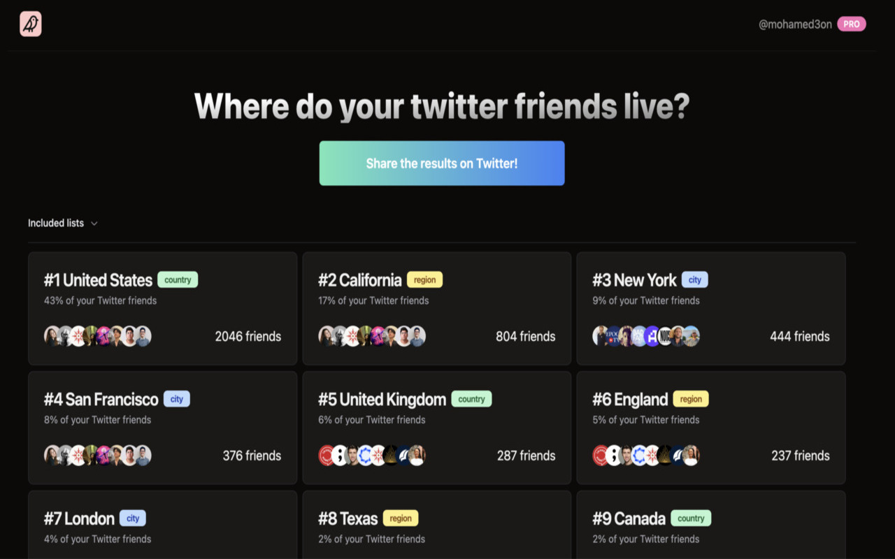

# Tribe Finder [DEPRECATED]



> **⚠️ This project is no longer functional due to Twitter's deprecation of the v1.1 API in 2025.**
>
> This repository is archived for historical and educational purposes.

## What Tribe Finder Was

Tribe Finder was a free Chrome extension that helped you discover where your Twitter friends were located around the world. Inspired by [Smallworld](https://github.com/devonzuegel/smallworld), it provided a visual way to explore your Twitter network geographically.

## How It Worked

### The Core Mechanism

1. **User Input**: Users entered any public Twitter username (including their own)
2. **Data Collection**: The extension injected a content script (`inject.js`) that made authenticated requests to Twitter's v1.1 API endpoints:
   - `friends/list.json` - to fetch the user's following list (up to 5000 accounts)
   - `lists/list.json` - to fetch the user's Twitter Lists
   - `lists/members.json` - to fetch members from each list
3. **Data Processing**:
   - Extracted location strings from user profiles
   - Used regex-based cleaning to normalize location data
   - Geocoded cleaned locations using Mapbox's Geocoding API
   - Aggregated data by country and city
4. **Storage**: All data was stored locally in Chrome's `chrome.storage.local` for privacy
5. **Display**: A Next.js-based UI rendered the data as an interactive list with statistics

### The API Workaround

The extension used hardcoded bearer tokens extracted from Twitter's web client to authenticate API requests without requiring users to log in. This approach worked by:

- Using Twitter's public web client bearer tokens (stored in `config.bearerToken`)
- Including an alternative token for rate limit fallback
- Making direct XMLHttpRequest calls to `api.twitter.com/1.1` endpoints

```javascript
// From inject.js
const config = {
  bearerToken: 'AAAAAAAAAAAAAAAAAAAAANRILgAAAAAAnNwIzUejRCOuH5E6I8xnZz4puTs%3D...',
  alternativeBearerToken: 'AAAAAAAAAAAAAAAAAAAAAFQODgEAAAAAVHTp76lzh3rFzcHbmHVvQxYYpTw%3D...',
  apiBaseURL: 'https://api.twitter.com/1.1',
};
```

### Features

- **City Discovery**: Find cities where your Twitter community was concentrated
- **Travel Planning**: Identify friends to meet when traveling
- **Sunshine Data**: See climate information for each city
- **Twitter Lists Support**: Include list members in your analysis
- **Privacy-First**: No login required, all data stored locally
- **Flexible**: Analyze any public Twitter profile, not just your own

### Limitations

- Only worked for public Twitter profiles
- Required at least 2 friends in a location to display it
- Only counted friends with valid location data in their profiles
- Rate-limited by Twitter's API (typically 15 requests per 15-minute window)

## Why It Stopped Working

In 2023, Twitter (now X) deprecated the v1.1 API and moved to a new API structure requiring paid authentication. The bearer tokens used by the extension were invalidated, making it impossible to fetch friend and list data.

The new Twitter API:

- Requires OAuth 2.0 authentication
- Has strict rate limits on free tiers
- Charges for elevated access to endpoints like friends/list
- Makes browser-based extensions like this one economically unfeasible

## Tech Stack

- **Frontend**: Next.js 14 (static export), React 18, TypeScript
- **Styling**: Tailwind CSS, Shadcn UI components
- **Chrome Extension**: Manifest V3, content scripts, chrome.storage API
- **Forms**: react-hook-form with Zod validation
- **APIs**: Twitter API v1.1 (deprecated), Mapbox Geocoding API

## Architecture

```
┌─────────────────┐
│  Chrome Popup   │  (Next.js static export)
│   (index.tsx)   │
└────────┬────────┘
         │
         ├─ chrome.storage.local (data persistence)
         │
         ├─ inject.js (injected into twitter.com)
         │     │
         │     ├─ Fetches following list
         │     ├─ Fetches user lists
         │     └─ Processes & geocodes locations
         │
         └─ Mapbox Geocoding API
```

## Local Development (Historical)

If you want to explore the code:

1. Clone the repository
2. Run `bun install`
3. Run `bun run dev` to start the development server
4. Go to `chrome://extensions/` in your browser
5. Enable developer mode
6. Click on `Load unpacked` and select the `out` folder

Note: The extension will not function without valid API access.

## Read More

For more context on why this project was built, see the [original blog post](https://www.mohamed3on.com/tribe-finder/).

## License

This project is archived and provided as-is for educational purposes.
